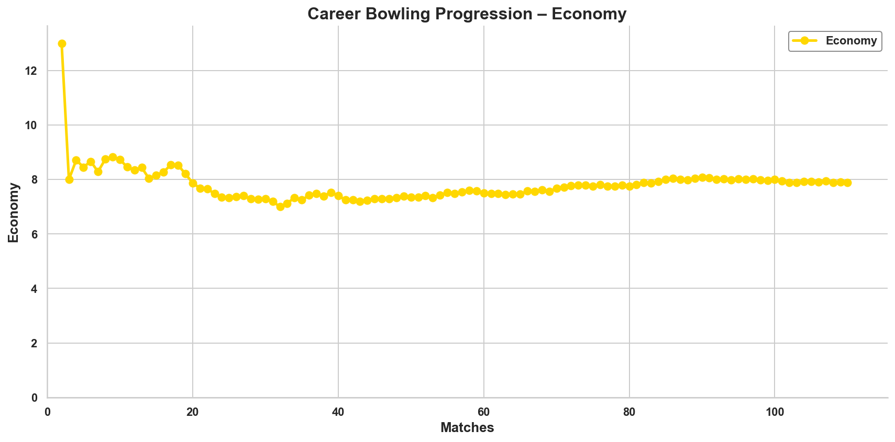
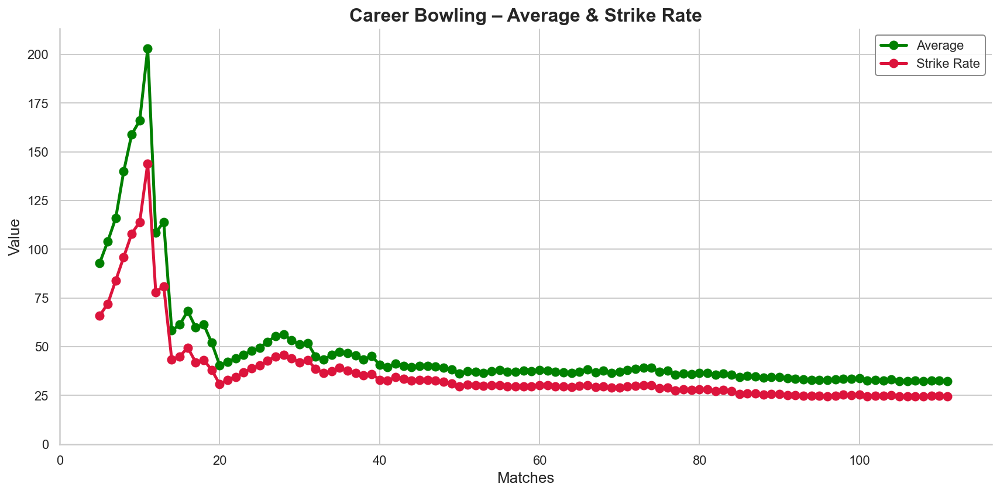
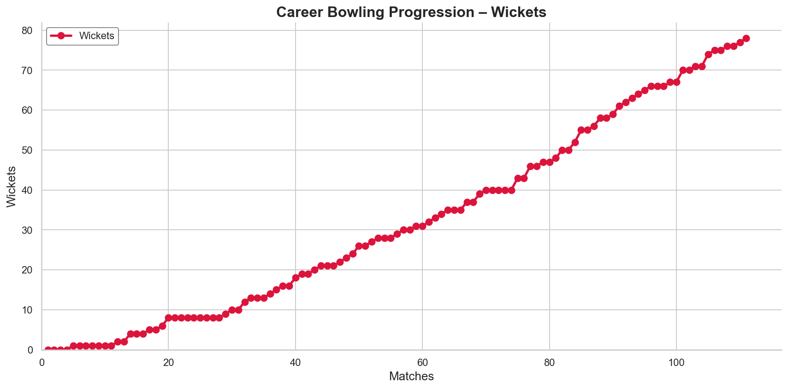
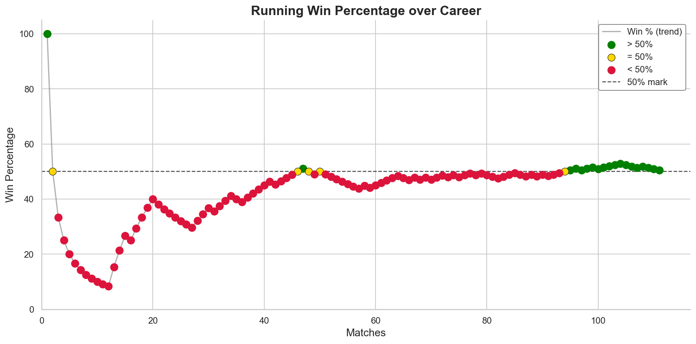
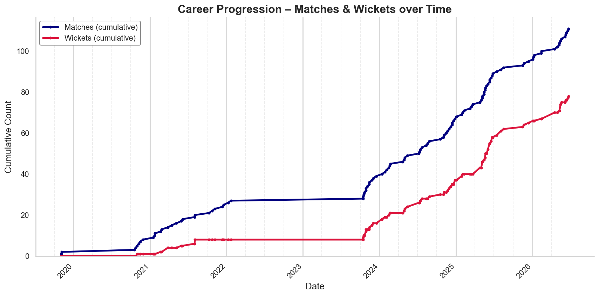
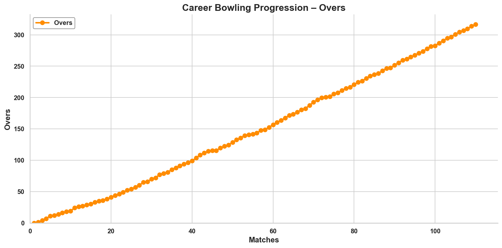
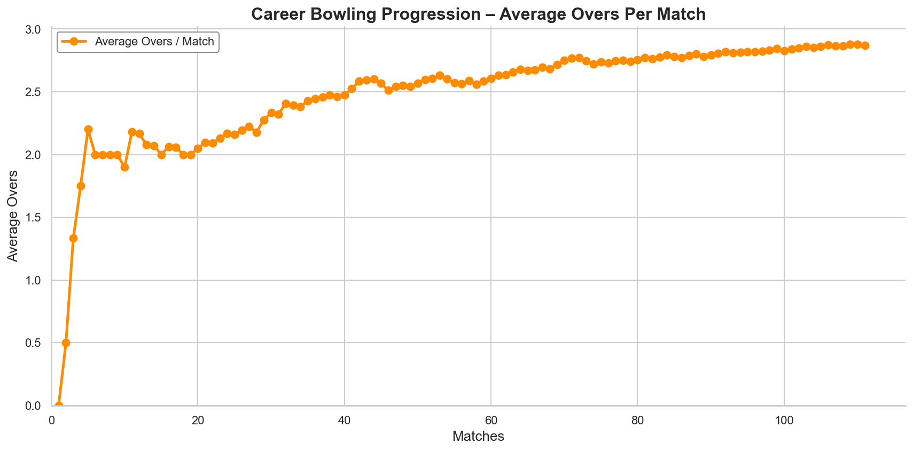
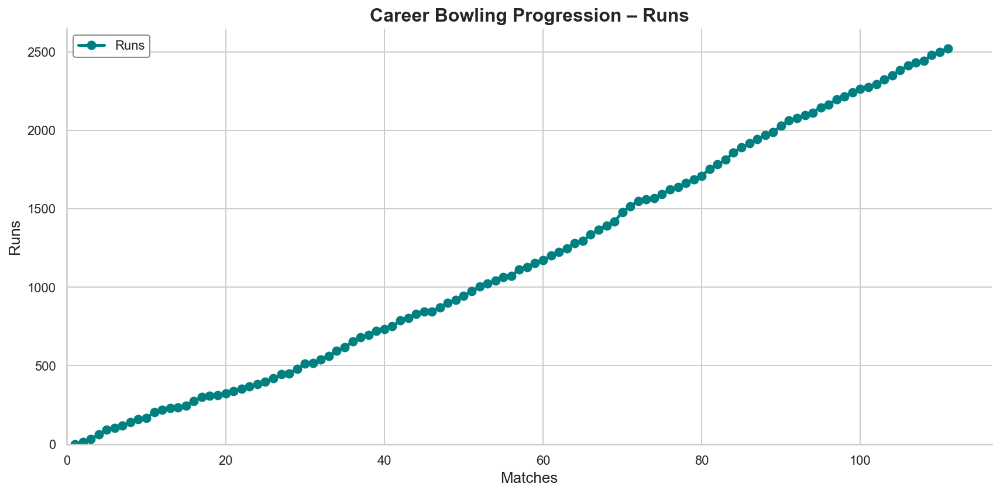
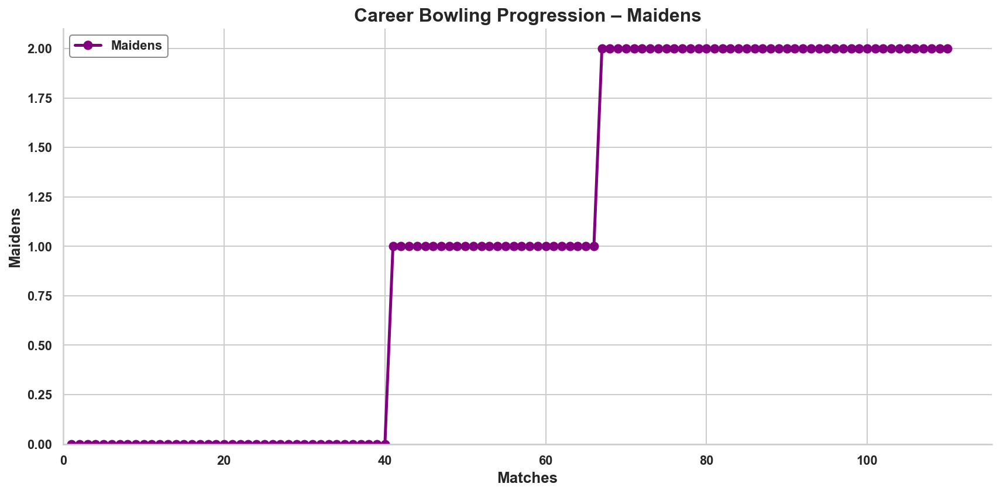

# Cricket Career Progression Analytics

## Overview

Most cricket analytics focus on isolated performances — a single match, a tournament, or a season.

This project takes a different approach.

Using cumulative performance metrics and concepts inspired by survival analysis, it tracks how a bowler's career evolves over time, showing not just where they are today, but how they got there.

Rather than treating every match independently, the analysis continuously updates career statistics after each game, creating a living record of improvement, consistency, and long-term development.

The result is a visual story of progression.

---

## Why This Project?

Averages, strike rates, and economy rates are often viewed as static numbers.

However, these metrics are the product of hundreds of overs, thousands of deliveries, and years of experience.

This project answers questions such as:

* How quickly did performance improve?
* When did major breakthroughs occur?
* How much impact did early performances have on career statistics?
* How long did it take for career figures to stabilize?
* What does long-term growth look like when viewed match by match?

By treating a cricket career as a time series rather than a collection of isolated matches, we gain a much deeper understanding of player development.

---

## Methodology

The analysis calculates cumulative career statistics after every match:

### Career Economy Rate
#### Average number of runs given per over

Shows the lack of experience in the beginning where the scores are higher (especially the first game). Overtime, the economy goes from 9 to around 7 and thats where I started becoming really good at it. After around match 40, I started playing with senior teams and the economy increased to what it is now at around the mean of 8.

### Career Average and Strike Rate
#### Average number of balls and runs per wicket

The reason the lines starts later is because I did not take my first wicket until the 5th game, and then the second wicket 7 games later. Shows the inexperience. Finally after around match 30 did the strike rate start to get lower gradually towards the mean 24.
The average line beautifully mimics the strike rate lines as the formula for strike rate and average revolve around the same essentials.

### Career Wickets
#### Cumulative Wickets

We can see the flattened out bits of the curve showing my wicketless spells, and also the spikes where I started collecting more.

### Career Win Percentage
#### Win/(Loss+Tie)

Took about 40+ games to finally have a 50-50 win-loss ratio after the first 2 games. Defenders had a habit of losing and joining Heriot helped win more often.

### Career Matches With Wickets Overtime
#### With dates as y-axeis

We can see the massive flat line of almost 2 years, that was when I started A-levels and later picked up again after joining university.

### Career Overs Bowled
#### Cumulative Overs

Overall quite straight of a line, showing how I regularly bowl 3-4 overs every match. Thats expected of a strike bowler (humbly speaking).

### Career Average Over Load Per Match
#### Cumulative Overs Per Match

Very visible that I wasn't given full 4 overs in the beginning of my career as I was not as reliable. Overtime I started bowling full overs and now the average is reaching 3 overs per match.

### Career Runs Conceded
#### Cumulative Runs Conceded

Also a relatively straight line, a slight bump around match 70 where I probably got smacked.

### Maidens Bowled
#### Cumulative Maidens Bowled

Shows how rare bowling maidens is in t20, only bowled 2 and its been 40 matches since I last bowled one. Almost bowled another in match 110 but the fielder messed it up.

---

## Survival Analysis Inspiration

Traditional cricket statistics provide snapshots.

This project borrows ideas from survival analysis by focusing on progression over exposure and time.

Instead of analysing a single performance, the analysis follows the evolution of career metrics as additional overs are bowled and more wickets are taken.

This perspective helps reveal:

* Learning curves
* Performance stabilization
* Long-term consistency
* Career milestones
* The impact of experience on results

---

## Key Insight

One of the most fascinating observations is how volatile career statistics are in the early stages.

A single wicket or expensive spell can dramatically alter averages and strike rates.

As more matches are played, the metrics gradually stabilize and begin to reflect true performance levels.

The charts tell a story that raw statistics alone cannot:

A journey from uncertainty and small sample sizes to consistency, experience, and sustained performance.

---

## Technologies Used

* Python
* Pandas
* NumPy
* Matplotlib
* OpenPyXL

---

## What Makes This Different?

Many sports analytics projects focus on predicting future performance or comparing players.

This project focuses on something more personal:

**Visualizing growth.**

Every point on the graph represents another match played, another lesson learned, and another step forward.

The final statistics are important, but the path taken to reach them is where the real story lives.

These visualizations demonstrate how performance evolves through persistence, experience, and time — turning a collection of scorecards into a narrative of continuous improvement.
